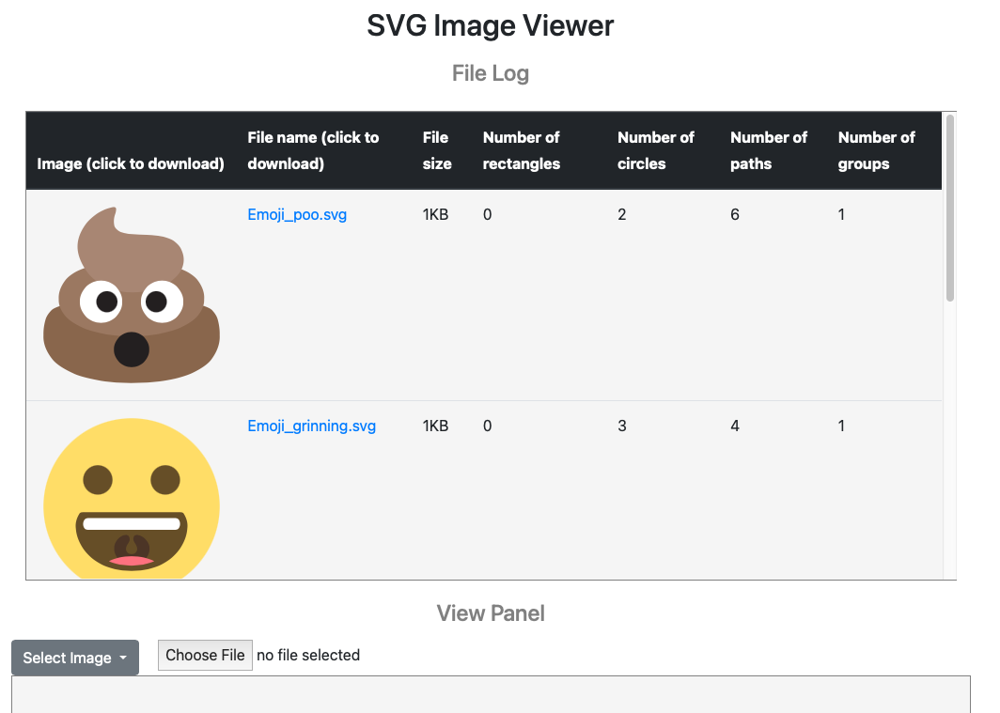

# SVG-Editor
A web application that can edit SVG files with a C backend

Project Summary: This application uses a C backend to parse SVG files and display them to a web application. The C code uses the software library libxml2, used for
parsing xml files. The backend has functions for creating, editing, deleting, and gathering data on SVG files. The makefile uses dynamic linking and creates a 
shared object file, libsvgparse.so, which is read by the Node library, ffi-napi, to allow the C functions to be used in the Javascript frontend. 

Tools Used: C, Javascript, Make, Express, Ajax, Node, libxml2, HTML, CSS, Bootstrap 4

